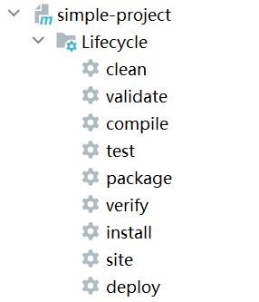
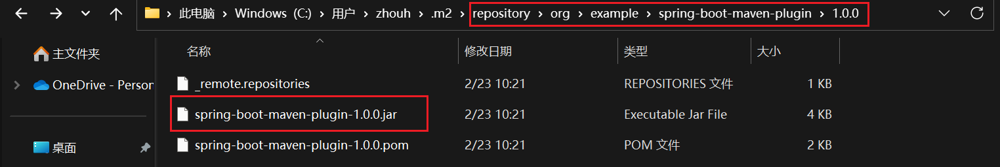

# Maven Plugin Development

## getLog().info() 和 System.out.print() 区别 

参考 DisplayTimeMojo

[INFO] 2023-02-23 05:14:58   
print something else.

```shell
E:\java-project\maven-plugin-development\simple-project>mvn spring-boot:displayTime
# 扫描所有项目
[INFO] Scanning for projects...
[INFO] 
# 某个具体项目 ---< 组织名:项目名 >----
[INFO] ---------------------< org.example:simple-project >---------------------
# 正在构建 项目名 版本号
[INFO] Building simple-project 1.0-SNAPSHOT
# ------[ 打包方式 ]---------- packaging jar
[INFO] --------------------------------[ jar ]---------------------------------
[INFO]
# --- 插件名:插件版本号:任务名
[INFO] --- spring-boot-maven-plugin:1.0.0:displayTime (default-cli) @ simple-project ---
[INFO] 2023-02-23 05:14:58    
print something else.
[INFO] ------------------------------------------------------------------------
# 构建成功
[INFO] BUILD SUCCESS
[INFO] ------------------------------------------------------------------------
# 构建总耗时 0.110 秒
[INFO] Total time:  0.110 s
# 结束时间 2023-02-23时间17:14:58 +08:00 世界时间加八小时后的时间 东八区
[INFO] Finished at: 2023-02-23T17:14:58+08:00
[INFO] ------------------------------------------------------------------------

```

## spring-boot-maven-plugin 参考

https://github.com/spring-projects/spring-boot/tree/main/spring-boot-project/spring-boot-tools/spring-boot-maven-plugin/src/main/java/org/springframework/boot/maven

## 构建阶段Goals执行顺序

默认是 原来的Goals会先执行，然后再执行POM配置的Goals

If more than one goal is bound to a particular phase, the order used is that those from the packaging are executed first, followed by those configured in the POM. Note that you can use the <executions> element to gain more control over the order of particular goals.

## 内置的生命周期绑定

**Built-in Lifecycle Bindings**

Some phases have goals bound to them by default. And for the default lifecycle, these bindings depend on the packaging value. Here are some of the goal-to-build-phase bindings.

**Clean Lifecycle Bindings**

Phase	plugin:goal
clean	clean:clean

**Default Lifecycle Bindings - Packaging ejb / ejb3 / jar / par / rar / war**

Phase	                plugin:goal
process-resources	    resources:resources
compile             	compiler:compile
process-test-resources	resources:testResources
test-compile	        compiler:testCompile
test	                surefire:test
package	                ejb:ejb or ejb3:ejb3 or jar:jar or par:par or rar:rar or war:war
install	                install:install
deploy	                deploy:deploy

**Default Lifecycle Bindings - Packaging ear**

Phase	plugin:goal

generate-resources	ear:generate-application-xml
process-resources	resources:resources
package	            ear:ear
install	            install:install
deploy	            deploy:deploy

**Default Lifecycle Bindings - Packaging maven-plugin**

Phase	                plugin:goal
generate-resources	    plugin:descriptor
process-resources	    resources:resources
compile	                compiler:compile
process-test-resources	resources:testResources
test-compile	        compiler:testCompile
test	                surefire:test
package	                jar:jar and plugin:addPluginArtifactMetadata
install	                install:install
deploy	                deploy:deploy

**Default Lifecycle Bindings - Packaging pom**

Phase	plugin:goal
package
install	install:install
deploy	deploy:deploy

**Site Lifecycle Bindings**

Phase	    plugin:goal
site	    site:site
site-deploy	site:deploy


## 打包方式 packaging

不同的打包方式，会让Default生命周期的阶段绑定不同的Goals

Some of the valid packaging values are jar, war, ear and pom. If no packaging value has been specified, it will default to jar.

默认 jar，如果是 pom 那么项目是纯元数据

a project that is purely metadata (packaging value is pom) only binds goals to the install and deploy phases

## 生命周期和插件的关系

https://maven.apache.org/guides/introduction/introduction-to-the-lifecycle.html

一个构建生命周期由多个阶段组成，一个阶段有多个插件目标组成

不同的生命周期会有不同的阶段组成

The clean and package arguments are build phases, while the dependency:copy-dependencies is a goal (of a plugin).

`mvn clean dependency:copy-dependencies package`

clean package 是构建阶段， dependency:copy-dependencies是一个插件目标

A Build Lifecycle is Made Up of Phases
Each of these build lifecycles is defined by a different list of build phases, wherein a build phase represents a stage in the lifecycle.

For example, the default lifecycle comprises of the following phases (for a complete list of the lifecycle phases, refer to the Lifecycle Reference):

+ validate - validate the project is correct and all necessary information is available
+ compile - compile the source code of the project
+ test - test the compiled source code using a suitable unit testing framework. These tests should not require the code be packaged or deployed
+ package - take the compiled code and package it in its distributable format, such as a JAR.
+ verify - run any checks on results of integration tests to ensure quality criteria are met
+ install - install the package into the local repository, for use as a dependency in other projects locally
+ deploy - done in the build environment, copies the final package to the remote repository for sharing with other developers and projects.

These lifecycle phases (plus the other lifecycle phases not shown here) are executed sequentially to complete the default lifecycle. Given the lifecycle phases above, this means that when the default lifecycle is used, Maven will first validate the project, then will try to compile the sources, run those against the tests, package the binaries (e.g. jar), run integration tests against that package, verify the integration tests, install the verified package to the local repository, then deploy the installed package to a remote repository.

A plugin goal represents a specific task (finer than a build phase) which contributes to the building and managing of a project. It may be bound to zero or more build phases. A goal not bound to any build phase could be executed outside of the build lifecycle by direct invocation.

+ 一个插件目标表示一个特定任务
+ 一个插件目标可以被绑定到0个或多个构建阶段
+ 一个没有绑定到构建阶段的目标可以在构建生命周期外直接调用执行

## Plugin Developing Document

https://maven.apache.org/plugin-developers/index.html

## 对比 mvn compiler:compile 和 mvn compile, mvn spring-boot:sayhi 和 mvn sayhi

mvn命令 的参数 可以直接提供构建阶段 或 提供某个插件的目标，区分方式为，是否有`:`

The clean and package arguments are build phases, while the dependency:copy-dependencies is a goal (of a plugin).

`mvn clean dependency:copy-dependencies package`

mvn compiler:compile 和 mvn compile 

mvn spring-boot:sayhi 正常运行，但 mvn sayhi 会出现错误 Unknown lifecycle phase "sayhi"



```text
E:\java-project\maven-plugin-development\simple-project>mvn spring-boot:sayhi 
[INFO] Scanning for projects...
[INFO] 
[INFO] ---------------------< org.example:simple-project >---------------------
[INFO] Building simple-project 1.0-SNAPSHOT
[INFO] --------------------------------[ jar ]---------------------------------
[INFO]
[INFO] --- spring-boot-maven-plugin:1.0.0:sayhi (default-cli) @ simple-project ---
[INFO] Hello, world.
[INFO] ------------------------------------------------------------------------
[INFO] BUILD SUCCESS
[INFO] ------------------------------------------------------------------------
[INFO] Total time:  0.114 s
[INFO] Finished at: 2023-02-23T10:54:12+08:00
[INFO] ------------------------------------------------------------------------


E:\java-project\maven-plugin-development\simple-project>mvn sayhi  
[INFO] Scanning for projects...
[INFO] 
[INFO] ---------------------< org.example:simple-project >---------------------
[INFO] Building simple-project 1.0-SNAPSHOT
[INFO] --------------------------------[ jar ]---------------------------------
[INFO] ------------------------------------------------------------------------
[INFO] BUILD FAILURE
[INFO] ------------------------------------------------------------------------
[INFO] Total time:  0.059 s
[INFO] Finished at: 2023-02-23T10:52:49+08:00
[INFO] ------------------------------------------------------------------------
[ERROR] Unknown lifecycle phase "sayhi". You must specify a valid lifecycle phase or a goal in the format <plugin-prefix>:<goal> or <plugin-group-id>:<plugin-artifact-id>[:<p
lugin-version>]:<goal>. Available lifecycle phases are: validate, initialize, generate-sources, process-sources, generate-resources, process-resources, compile, process-class
es, generate-test-sources, process-test-sources, generate-test-resources, process-test-resources, test-compile, process-test-classes, test, prepare-package, package, pre-integration-test, integration-test, post-integration-test, verify, install, deploy, pre-clean, clean, post-clean, pre-site, site, post-site, site-deploy. -> [Help 1]
[ERROR]
[ERROR] To see the full stack trace of the errors, re-run Maven with the -e switch.
[ERROR] Re-run Maven using the -X switch to enable full debug logging.
[ERROR]
[ERROR] For more information about the errors and possible solutions, please read the following articles:
[ERROR] [Help 1] http://cwiki.apache.org/confluence/display/MAVEN/LifecyclePhaseNotFoundException

E:\java-project\maven-plugin-development\simple-project>mvn compile          
[INFO] Scanning for projects...
[INFO] 
[INFO] ---------------------< org.example:simple-project >---------------------
[INFO] Building simple-project 1.0-SNAPSHOT
[INFO] --------------------------------[ jar ]---------------------------------
[INFO] 
[INFO] --- maven-resources-plugin:2.6:resources (default-resources) @ simple-project ---
[INFO] Using 'UTF-8' encoding to copy filtered resources.
[INFO] skip non existing resourceDirectory E:\java-project\maven-plugin-development\simple-project\src\main\resources
[INFO]
[INFO] --- maven-compiler-plugin:3.1:compile (default-compile) @ simple-project ---
[INFO] Nothing to compile - all classes are up to date
[INFO]
[INFO] --- spring-boot-maven-plugin:1.0.0:sayhi (default) @ simple-project ---
[INFO] Hello, world.
[INFO] ------------------------------------------------------------------------
[INFO] BUILD SUCCESS
[INFO] ------------------------------------------------------------------------
[INFO] Total time:  0.374 s
[INFO] Finished at: 2023-02-23T10:52:31+08:00
[INFO] ------------------------------------------------------------------------


E:\java-project\maven-plugin-development\simple-project>mvn compiler:compile 
[INFO] Scanning for projects...
[INFO] 
[INFO] ---------------------< org.example:simple-project >---------------------
[INFO] Building simple-project 1.0-SNAPSHOT
[INFO] --------------------------------[ jar ]---------------------------------
[INFO]
[INFO] --- maven-compiler-plugin:3.1:compile (default-cli) @ simple-project ---
[INFO] Nothing to compile - all classes are up to date
[INFO] ------------------------------------------------------------------------
[INFO] BUILD SUCCESS
[INFO] ------------------------------------------------------------------------
[INFO] Total time:  0.335 s
[INFO] Finished at: 2023-02-23T10:52:08+08:00
[INFO] ------------------------------------------------------------------------

```

## 将 Mojo 附加到 项目构建生命周期

```text
E:\java-project\maven-plugin-development\simple-project>mvn compile
[INFO] Scanning for projects...
[INFO] 
[INFO] ---------------------< org.example:simple-project >---------------------
[INFO] Building simple-project 1.0-SNAPSHOT
[INFO] --------------------------------[ jar ]---------------------------------
[INFO] 
[INFO] --- maven-resources-plugin:2.6:resources (default-resources) @ simple-project ---
[INFO] Using 'UTF-8' encoding to copy filtered resources.
[INFO] skip non existing resourceDirectory E:\java-project\maven-plugin-development\simple-project\src\main\resources
[INFO]
[INFO] --- maven-compiler-plugin:3.1:compile (default-compile) @ simple-project ---
[INFO] Changes detected - recompiling the module!
[INFO] Compiling 2 source files to E:\java-project\maven-plugin-development\simple-project\target\classes
[INFO] 
[INFO] --- spring-boot-maven-plugin:1.0.0:sayhi (default) @ simple-project ---
[INFO] Hello, world.
[INFO] ------------------------------------------------------------------------
[INFO] BUILD SUCCESS
[INFO] ------------------------------------------------------------------------
[INFO] Total time:  0.644 s
[INFO] Finished at: 2023-02-23T10:49:21+08:00
[INFO] ------------------------------------------------------------------------


Attaching the Mojo to the Build Lifecycle
You can also configure your plugin to attach specific goals to a particular phase of the build lifecycle. Here is an example:

  <build>
    <pluginManagement>
      <plugins>
        <plugin>
          <groupId>sample.plugin</groupId>
          <artifactId>hello-maven-plugin</artifactId>
          <version>1.0-SNAPSHOT</version>
        </plugin>
      </plugins>
    </pluginManagement>  
    <plugins>
      <plugin>
        <groupId>sample.plugin</groupId>
        <artifactId>hello-maven-plugin</artifactId>
        <executions>
          <execution>
            <phase>compile</phase>
            <goals>
              <goal>sayhi</goal>
            </goals>
          </execution>
        </executions>
      </plugin>
    </plugins>
  </build>
This causes the simple mojo to be executed whenever Java code is compiled. For more information on binding a mojo to phases in the lifecycle, please refer to the Build Lifecycle document.
```

## 执行Mojo/Goal 缩短命令行

```text
Shortening the Command Line
There are several ways to reduce the amount of required typing:

If you need to run the latest version of a plugin installed in your local repository, you can omit its version number. So just use "mvn sample.plugin:hello-maven-plugin:sayhi" to run your plugin.
You can assign a shortened prefix to your plugin, such as mvn hello:sayhi. This is done automatically if you follow the convention of using ${prefix}-maven-plugin (or maven-${prefix}-plugin if the plugin is part of the Apache Maven project). You may also assign one through additional configuration - for more information see Introduction to Plugin Prefix Mapping.
Finally, you can also add your plugin's groupId to the list of groupIds searched by default. To do this, you need to add the following to your ${user.home}/.m2/settings.xml file:
<pluginGroups>
  <pluginGroup>sample.plugin</pluginGroup>
</pluginGroups>
At this point, you can run the mojo with "mvn hello:sayhi".
```

## 测试

```shell
E:\java-project\maven-plugin-development\maven-plugin-test>mvn org.example:spring-boot-maven-plugin:1.0.0:sayhi
[INFO] Scanning for projects...
[INFO] 
[INFO] -------------------< org.example:maven-plugin-test >--------------------
[INFO] Building maven-plugin-test 1.0-SNAPSHOT
[INFO] --------------------------------[ jar ]---------------------------------
[INFO]
[INFO] --- spring-boot-maven-plugin:1.0.0:sayhi (default-cli) @ maven-plugin-test ---
[INFO] Hello, world.
[INFO] ------------------------------------------------------------------------
[INFO] BUILD SUCCESS
[INFO] ------------------------------------------------------------------------
[INFO] Total time:  0.106 s
[INFO] Finished at: 2023-02-23T10:37:53+08:00
[INFO] ------------------------------------------------------------------------

```

```shell
E:\java-project\maven-plugin-development\maven-plugin-test>mvn spring-boot:sayhi
[INFO] Scanning for projects...
[INFO] 
[INFO] -------------------< org.example:maven-plugin-test >--------------------
[INFO] Building maven-plugin-test 1.0-SNAPSHOT
[INFO] --------------------------------[ jar ]---------------------------------
[INFO]
[INFO] --- spring-boot-maven-plugin:1.0.0:sayhi (default-cli) @ maven-plugin-test ---
[INFO] Hello, world.
[INFO] ------------------------------------------------------------------------
[INFO] BUILD SUCCESS
[INFO] ------------------------------------------------------------------------
[INFO] Total time:  0.221 s
[INFO] Finished at: 2023-02-23T10:37:02+08:00
[INFO] ------------------------------------------------------------------------
```

## 全限定目标名

specify a fully-qualified goal in the form of:

`mvn groupId:artifactId:version:goal`

`mvn org.example:spring-boot-maven-plugin:1.0.0:sayhi`

Tips: version is not required to run a standalone goal.

## mvn install 



## 插件没发布

```shell
> mvn org.example:spring-boot-maven-plugin:1.0.0:sayhi
[INFO] Scanning for projects...
Downloading from aliyunmaven: https://maven.aliyun.com/repository/public/org/example/spring-boot-maven-plugin/1.0.0/spring-boot-maven-plugin-1.0.0.jar
[INFO] ------------------------------------------------------------------------
[INFO] BUILD FAILURE
[INFO] ------------------------------------------------------------------------   
[INFO] Total time:  1.043 s
[INFO] Finished at: 2023-02-23T10:13:31+08:00
[INFO] ------------------------------------------------------------------------   
[ERROR] Plugin org.example:spring-boot-maven-plugin:1.0.0 or one of its dependenci
es could not be resolved: Could not find artifact org.example:spring-boot-maven-pl
ugin:jar:1.0.0 in aliyunmaven (https://maven.aliyun.com/repository/public) -> [Help 1]
[ERROR]
[ERROR] To see the full stack trace of the errors, re-run Maven with the -e switch.
[ERROR] Re-run Maven using the -X switch to enable full debug logging.
[ERROR]
[ERROR] For more information about the errors and possible solutions, please read the following articles:
[ERROR] [Help 1] http://cwiki.apache.org/confluence/display/MAVEN/PluginResolutionException

E:\java-project\maven-plugin-development\spring-boot-maven-plugin>mvn org.example:spring-boot-maven-plugin:1.0.0:sayhi
[INFO] Scanning for projects...
Downloading from central: https://repo.maven.apache.org/maven2/org/example/spring-boot-maven-plugin/1.0.0/spring-boot-maven-plugin-1.0.0.jar
[INFO] ------------------------------------------------------------------------
[INFO] BUILD FAILURE
[INFO] ------------------------------------------------------------------------   
[INFO] Total time:  20.950 s
[INFO] Finished at: 2023-02-23T10:17:59+08:00
[INFO] ------------------------------------------------------------------------   
[ERROR] Plugin org.example:spring-boot-maven-plugin:1.0.0 or one of its dependenci
es could not be resolved: Could not find artifact org.example:spring-boot-maven-plugin:jar:1.0.0 in central (https://repo.maven.apache.org/maven2) -> [Help 1]      
[ERROR]
[ERROR] To see the full stack trace of the errors, re-run Maven with the -e switch.
[ERROR] Re-run Maven using the -X switch to enable full debug logging.
[ERROR]
[ERROR] For more information about the errors and possible solutions, please read the following articles:
[ERROR] [Help 1] http://cwiki.apache.org/confluence/display/MAVEN/PluginResolutionException

```

## Plugin介绍

Maven consists of a core engine which provides basic project-processing capabilities and build-process management, and a host of plugins which are used to execute the actual build tasks.

What is a Plugin?
"Maven" is really just a core framework for a collection of Maven Plugins. In other words, plugins are where much of the real action is performed, plugins are used to: create jar files, create war files, compile code, unit test code, create project documentation, and on and on. Almost any action that you can think of performing on a project is implemented as a Maven plugin.

Plugins are the central feature of Maven that allow for the reuse of common build logic across multiple projects. They do this by executing an "action" (i.e. creating a WAR file or compiling unit tests) in the context of a project's description - the Project Object Model (POM). Plugin behavior can be customized through a set of unique parameters which are exposed by a description of each plugin goal (or Mojo).

One of the simplest plugins in Maven is the Clean Plugin. The Maven Clean plugin (maven-clean-plugin) is responsible for removing the target directory of a Maven project. When you run "mvn clean", Maven executes the "clean" goal as defined in the Clean plug-in, and the target directory is removed. The Clean plugin defines a parameter which can be used to customize plugin behavior, this parameter is called outputDirectory and it defaults to ${project.build.directory}.

What is a Mojo (And Why the H--- is it Named 'Mojo')?
A Mojo is really just a goal in Maven, and plug-ins consist of any number of goals (Mojos). Mojos can be defined as annotated Java classes or Beanshell script. A Mojo specifies metadata about a goal: a goal name, which phase of the lifecycle it fits into, and the parameters it is expecting.

MOJO is a play on POJO (Plain-old-Java-object), substituting "Maven" for "Plain". Mojo is also an interesting word (see definition). From Wikipedia, a "mojo" is defined as: "...a small bag worn by a person under the clothes (also known as a mojo hand). Such bags were thought to have supernatural powers, such as protecting from evil, bringing good luck, etc."

## Mojo

What is a Mojo? A mojo is a Maven plain Old Java Object. Each mojo is an executable goal in Maven, and a plugin is a distribution of one or more related mojos.

一个Mojo是一个Maven Plain Old Java Object。在Maven，每一个Mojo是一个可执行的目标，然后一个插件就是用来发布一个或多个相关的Mojos

## 插件命名规范

You will typically name your plugin <yourplugin>-maven-plugin.

Calling it maven-<yourplugin>-plugin (note "Maven" is at the beginning of the plugin name) is strongly discouraged since it's a reserved naming pattern for official Apache Maven plugins maintained by the Apache Maven team with groupId org.apache.maven.plugins. Using this naming pattern is an infringement of the Apache Maven Trademark.

## Mojo/Goal执行能抛出两个异常

+ org.apache.maven.plugin.MojoExecutionException
  "BUILD ERROR" message
+ org.apache.maven.plugin.MojoFailureException
  "BUILD FAILURE" message

```text
The execute method can throw two exceptions:
org.apache.maven.plugin.MojoExecutionException if an unexpected problem occurs. Throwing this exception causes a "BUILD ERROR" message to be displayed.
org.apache.maven.plugin.MojoFailureException if an expected problem (such as a compilation failure) occurs. Throwing this exception causes a "BUILD FAILURE" message to be displayed
```


